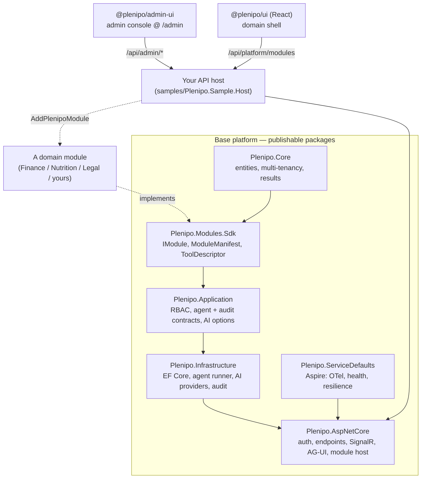
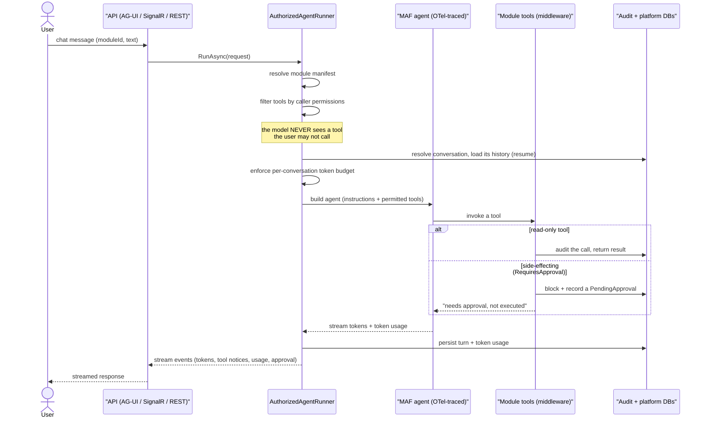
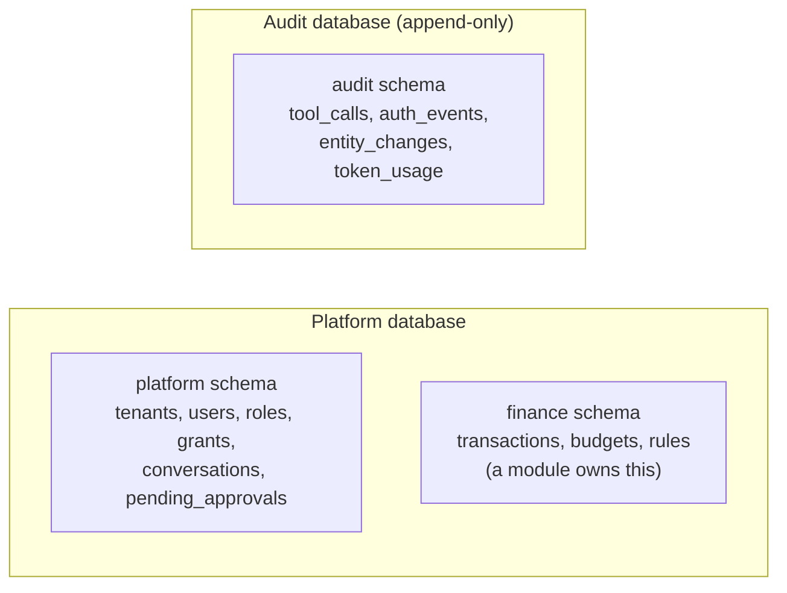

# Plenipo architecture

This is the map of how Plenipo fits together — read it after [GETTING_STARTED.md](GETTING_STARTED.md) if you
want to understand the codebase or build a vertical on it.

## What Plenipo is

Plenipo is a **base platform for AI-first, chat-first products**. The thesis: every "AI app for industry X"
needs the same backbone — a chat assistant with tools, tenant isolation, role-based access, an audit trail,
cost tracking, and a dashboard — and differs only in its *domain* (the tools, data, and instructions). So
Plenipo makes the backbone a reusable platform and the domain a **module**.

- The platform ships as **NuGet packages** (backend) and an **npm library** (frontend).
- A product is a thin **host** that installs one or more modules; it is not a fork of the platform.
- A **module** implements one interface (`IModule`) and declares its capabilities up front (manifest-first).

The headline design choice is **tool security before the model call**: the agent runner filters tools by the
caller's permissions *before* building the LLM request, so the model never even sees the schema of a tool the
user isn't allowed to invoke. Side-effecting tools are gated further by **human-in-the-loop approval**.

## The big picture



## A chat turn, end to end

This is the security spine — the most important flow to understand.



The same `AuthorizedAgentRunner` backs all three transports: the open **AG-UI** protocol
(`POST /api/agui/{moduleId}`, SSE), **SignalR** (`/hubs/agent`), and a **REST** stream
(`POST /api/chat/stream`). RBAC filtering, auditing, token tracking, and approval all apply regardless.

## The module system

A vertical plugs in through one interface — declared statically, so the platform can reason about
capabilities (navigation, permissions, audit policy) without running module code.

```csharp
public interface IModule
{
    ModuleManifest Manifest { get; }                              // tools, tabs, roles, agent instructions
    void RegisterServices(IServiceCollection services, IConfiguration config);
    void MapEndpoints(IEndpointRouteBuilder endpoints);
    Task MigrateAsync(IServiceProvider services, CancellationToken ct = default);  // optional: own DB
    Task SeedAsync(IServiceProvider services, CancellationToken ct = default);     // optional
}
```

- The **manifest** lists `ToolDescriptor`s (name, description, the permission the tool requires, and whether
  it `RequiresApproval`) and `TabDescriptor`s (which drive the dashboard navigation, server-side).
- An `IModuleToolSource` supplies the *executable* tools (`AIFunction`s bound to permissions).
- A module may own persistence (its own `DbContext` + schema, migrated via `MigrateAsync`) or be stateless.

The three sample verticals show the spectrum: **Finance** (stateful — learns categories, budgets, HITL
transaction recording), **Nutrition** and **Legal** (stateless reference data + drafting). The host installs
them with `builder.AddPlenipoModule<FinanceModule>()`.

## Data & multi-tenancy



Every tenant-owned entity implements `ITenantOwned`; EF Core **global query filters** on `TenantId` are
applied automatically by reflection, so no query — including one written by module code — can cross a tenant
boundary. The audit store is a separate database (separate credential in production) that application code
only ever appends to. In production the platform and audit databases are distinct (Terraform provisions
both); for local dev they share one Postgres via distinct schemas.

Audit writes are **durable**: the audit log writes straight to the audit store (synchronous, immediately
queryable), but if that write fails — a transient audit-DB outage — the record is serialized to an
`audit_outbox` table in the platform DB and a background `AuditOutboxProcessor` flushes it once the audit
store recovers. So a momentary outage defers audit records instead of dropping them, and the "audit
everything" guarantee survives an audit-DB blip without ever failing the user-facing operation.

## Security model

Three layers, evaluated by `PermissionMatcher` (supports `*` and dotted wildcards like `tools.finance.*`):

1. **System roles** — `system_admin`, `tenant_admin`, `user`, `guest`. The role → permission baseline is a
   **per-tenant, runtime-editable** mapping (`role_permissions` table), seeded from the built-in
   `RolePermissions.Defaults` and edited in the admin console; a tenant with no rows falls back to the
   defaults. `PermissionResolver` expands a principal's roles through this mapping (see
   `RolePermissionResolution`). `system_admin` always resolves to `*` regardless of configuration — a
   lockout guardrail, and the role is rejected by the edit endpoint.
2. **Feature permissions** — dotted strings (`tools.finance.record_transaction`, `platform.users.manage`,
   `chat.approvals.manage`). Endpoints gate on these via a dynamic `IAuthorizationPolicyProvider`.
3. **Per-resource ACLs** — owner/editor/viewer (the seam exists; module-specific).

On top of that: **pre-model-call tool filtering** (the agent only receives tools the caller can invoke),
**human-in-the-loop approval** for side-effecting tools (blocked → recorded → an authorized human approves,
which re-executes the exact recorded call), and **dual-database audit** of every tool call, data change, and
token spend. The **admin console** surfaces all of this — and the runtime configuration around it: the role
editor with the live permission map, users, per-tenant module and connector enablement, tenants, AI
settings (runtime provider switching with vaulted keys), agent profiles (per-agent instructions,
tools, and model), token usage, the audit log, and an operations snapshot.

The LLM-backed chat endpoints (`/api/chat/stream`, `/api/agui/{moduleId}`) are additionally **rate-limited
per user** — a fixed window partitioned by the caller's `sub` claim, a cost/abuse backstop so one principal
can't exhaust the model budget or starve others. The limit is configurable (`RateLimiting:ChatPermitsPerMinute`,
generous by default); over-limit requests get `429` + `Retry-After`. A deactivated **user** — or every user
of a deactivated **tenant** — keeps a valid token but is denied every request (enforced in the
request-enrichment middleware and the SignalR hub filter): per-user and tenant-wide kill switches an operator
drives from the admin console.

## Observability

`Plenipo.ServiceDefaults` wires OpenTelemetry (ASP.NET Core + HttpClient + runtime). The agent pipeline is
additionally instrumented under the **`Plenipo.Agents`** source, so agent runs and LLM calls (with token
usage) surface in the **Aspire dashboard** alongside HTTP and database activity.

## Frontend

The frontend is **two surfaces**, deliberately separated so the product UI can be adapted/branded per host
while operator administration stays generic and consistent across every deployment:

- **`@plenipo/ui`** — the **end-user / domain** shell (a React + Vite library). It is **server-driven**: it
  builds the module switcher, tabs, and routes entirely from `GET /api/platform/modules`, so installing a
  backend module automatically adds its UI. It talks to the agent over SignalR (and ships an AG-UI client)
  and shows per-turn token usage. Domain-specific UI ships as separate packages that depend on it; the base
  library carries no vertical-specific and no admin code. It also re-exports the API/auth client layer
  (`api`, `useMe`, `hasPermission`, admin types) that the admin console consumes.
- **`@plenipo/admin-ui`** — the **admin console** (a standalone app, not a library): the security map, a
  **schema-driven role editor** (every permission toggle derived from the live catalog, so a new module's
  tools appear with no UI change — plus a free-text escape hatch for wildcards), users & grants,
  token-usage, and audit views. It reuses `@plenipo/ui`'s client layer and is served at
  `/admin` — by its own Vite dev server in development, or by the API host in an integrated deployment via
  `app.UsePlenipoAdminConsole()` (Plenipo's analogue of OpenClaw's "control UI built into the gateway"). The
  console is just static assets; the `/api/admin/*` endpoints it reads stay RBAC-gated server-side, so the
  API — not the asset host — remains the security boundary.

## Where to look in the code

| Concern | Start here |
|---------|-----------|
| Chat security spine | `src/Plenipo.Infrastructure/Agents/AuthorizedAgentRunner.cs` |
| Tool audit + approval gate | `src/Plenipo.Infrastructure/Agents/ToolInvocationMiddleware.cs` |
| Module contract | `src/Plenipo.Modules.Sdk/IModule.cs`, `ModuleManifest.cs` |
| RBAC | `src/Plenipo.Application/Authorization/` |
| Multi-tenancy | `src/Plenipo.Infrastructure/Persistence/PlatformDbContext.cs` |
| Endpoints (platform/chat/admin/approvals/AG-UI) | `src/Plenipo.AspNetCore/Endpoints/` |
| Serving the admin console at `/admin` | `src/Plenipo.AspNetCore/Hosting/AdminConsoleExtensions.cs` |
| Domain (end-user) UI | `frontend/plenipo-ui/` (`@plenipo/ui`) |
| Admin console app | `frontend/admin-ui/` (`@plenipo/admin-ui`) |
| A worked example module | `samples/Plenipo.Modules.Finance/` |
| Infra (Azure) | `infra/` (Terraform) + `.github/workflows/` |
