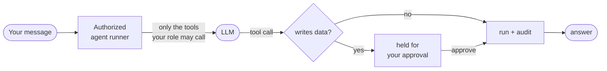

# Cortex

A **base platform** for building AI-first, chat-first applications across many industries on the
.NET + React stack. Cortex ships as a family of NuGet packages (backend) and npm libraries (frontend);
a product is a thin host that installs **modules**, not a fork of the platform.

Out of the box you get: a chat-first dashboard, a pluggable module system for domain verticals,
tool-level security for the agent (the model never sees a tool the user may not call), full audit
logging, token-usage monitoring, multi-tenancy, an admin/RBAC/security dashboard, and the IaC + CI/CD to
ship it. It unifies the patterns proven in two earlier apps — **NutriForge** (nutrition) and
**the-ledger** (personal finance) — so a new vertical is a *module*, not a new codebase.

> **New here?** [**GETTING_STARTED.md**](GETTING_STARTED.md) gets you from clone to a running chat with
> three demo verticals and the admin dashboard in three steps — no AI key required.
> [**ARCHITECTURE.md**](ARCHITECTURE.md) explains how it all fits together (with diagrams).
> [**docs/CONFIGURATION.md**](docs/CONFIGURATION.md) is the single answer to "how is this configured,
> by whom, and where do secrets (API keys) go" — including the `cortex init` wizard.
> [**docs/TESTING.md**](docs/TESTING.md) is how the base platform itself is run and tested.

## Core ideas

| Idea | How Cortex does it |
|------|--------------------|
| **Base, not fork** | The platform is 6 NuGet packages + two npm libraries (the domain shell `@cortex/ui` and the admin console `@cortex/admin-ui`). Your product references them and adds modules. |
| **Two UIs** | The end-user **domain UI** (`@cortex/ui`, branded per product) and the generic **admin console** (`@cortex/admin-ui`, served at `/admin`) are separate surfaces, so operator administration is consistent everywhere while the product UI stays adaptable. |
| **Chat-first** | Every module gets an agent; the dashboard front page is chat (over SignalR or the open **AG-UI** protocol). A **WhatsApp channel** (Meta Cloud API) routes phone messages through the same authorized runner — see [docs/WHATSAPP_CHANNEL.md](docs/WHATSAPP_CHANNEL.md). |
| **Modules, not forks** | A vertical implements `IModule`: a manifest of tools + tabs, its own services and endpoints. The host discovers and loads them. |
| **Verticals are separate systems** | Each vertical ships as its **own product** — own host, own repo, own deployment, own database — installing only its module(s) on the platform packages (see `samples/Cortex.Legal.Host` for the shape). A business that wants only finance runs only Cortex-for-finance. Systems connect through the **cortex-peer connector**: one deployment's agent asks another's over the open AG-UI protocol, with the peer enforcing its own auth, RBAC, and audit. `Cortex.Sample.Host` bundles three modules purely as a dev showcase. |
| **Manifest-first** | A module declares its tools, tabs, permissions, and agent instructions *statically*, before any of its code runs. |
| **Tool security before the model call** | The agent runner filters tools by the caller's permissions **before** building the request — the LLM never sees the schema of a tool the user may not call. |
| **Documents built in** | Every module's agent gets platform **document tools** — read PDFs (PdfPig, Apache-2.0), generate PDFs, list files, pluggable OCR — over a tenant-scoped file store with chat attachments in the UI. See [docs/DOCUMENT_TOOLS.md](docs/DOCUMENT_TOOLS.md). |
| **Knowledge search (opt-in RAG)** | Documents index into **scoped collections** (per matter/project); `search_knowledge` retrieves hybrid (pgvector + full-text, RRF) with per-passage citations, gated per collection through the owning module and **failing closed**. Keyless in dev via a deterministic Mock embedder. See [docs/PLATFORM_CONNECTORS_RAG_PLAN.md](docs/PLATFORM_CONNECTORS_RAG_PLAN.md). |
| **Agent composition (profiles + skills + MCP)** | Tenant admins compose chatbots Foundry/Copilot-Studio-style without code: **agent profiles** set a module agent's instructions *and which tools it may use* (selection only narrows RBAC); **skills** (SKILL.md bundles) ship with the host; **MCP servers** configured by the operator (`Mcp:Servers`) surface external tools through the same spine — RBAC-gated (`tools.mcp.*`, granted to no role by default), audited, approval-gated by default. |
| **Connectors** | A manifest-first **connector SDK** bridges agents to where tenant data already lives (Azure Blob ships; a keyless local-folder connector powers dev/CI). **Default-off per tenant** — an admin enables each on the console's Integrations page; secrets are write-only and protected at rest; fetches are approval-gated and land in the file store. |
| **Audit everything** | Every tool invocation, data change, and token spend is written to a separate, append-only audit database. |
| **Multi-tenant by default** | Row-level isolation via EF Core global query filters on `TenantId` — impossible to forget. |
| **Provider-swappable AI** | OpenAI / Azure OpenAI / Anthropic (Claude) / Ollama via one config section — plus a dependency-free **Mock** provider so the chatbot (and even real, audited tool calls + the approval gate) work with zero setup. Tenants can switch the whole connection at runtime from the admin UI (BYO key, vaulted write-only). |

Built on **.NET 10**, **Microsoft Agent Framework** (MAF) over **Microsoft.Extensions.AI**, **EF Core 10**
(+ Npgsql), **.NET Aspire**, and **React 18 + Vite**.

### The security spine — every chat turn

The agent never gets more power than the user who asked:



So the LLM never sees a tool you can't call, every invocation is audited, and anything side-effecting waits
for a human — by construction, not by prompt.

## Solution layout

The platform (`Cortex.slnx`) and the example apps (`samples/Cortex.Samples.slnx`) are **separate
solutions** — the platform never depends on a sample.

```
Cortex.slnx                          # the base platform (publishable)
└── src/
    ├── Cortex.Core/                 # Domain primitives: entities, multi-tenancy, results, identity
    ├── Cortex.Modules.Sdk/          # IModule, ModuleManifest, ToolDescriptor, TabDescriptor, ModuleTool
    ├── Cortex.Application/          # Contracts: RBAC, auditing, agents, conversations, token usage, AI options
    ├── Cortex.Infrastructure/       # EF Core, audit interceptor, RBAC, AI providers (+ Mock), the agent runner
    ├── Cortex.AspNetCore/           # Host integration: auth, middleware, SignalR + Redis, AG-UI, platform/chat/admin endpoints
    ├── Cortex.ServiceDefaults/      # Aspire: OpenTelemetry, health checks, resilience
    ├── Cortex.Api/                  # Minimal runnable host — a thin shell with NO domain modules
    └── Cortex.AppHost/              # Aspire orchestration for the bare platform
tests/                               # Cortex.Application.Tests, Cortex.Infrastructure.Tests

samples/Cortex.Samples.slnx          # example apps built ON the platform (NuGet in prod; ProjectReference for dev)
├── Cortex.Modules.Finance/          # the-ledger vertical — stateful, learns categories from corrections
├── Cortex.Modules.Nutrition/        # NutriForge vertical — food catalog + persisted food diary
├── Cortex.Modules.Legal/            # the-lawyer vertical — stateless clause library + drafting
├── Cortex.Sample.Host/              # runnable host wiring all three modules
└── Cortex.Sample.AppHost/           # Aspire orchestration for the sample (Postgres ×2, Redis, mock chat)

frontend/cortex-ui/                  # @cortex/ui — React + Vite library: the end-user (domain) chat shell + server-driven tabs
frontend/admin-ui/                   # @cortex/admin-ui — the admin console app (security/RBAC/users/usage/audit), served at /admin
infra/                               # Terraform (azurerm): Container Apps, Postgres, Redis, Key Vault, Entra External ID
.claude/skills/run-cortex/           # skill: run Aspire, read logs/telemetry, run the UI, test the chatbot
.github/workflows/                   # CI/CD: build + scan, deploy (OIDC), terraform PR checks
```

### Layered RBAC

1. **System roles** — `system_admin`, `tenant_admin`, `user`, `guest`. What each role *grants* is a
   per-tenant, **runtime-editable** baseline (seeded from built-in defaults), configured from the admin
   console — no code change to retune a role. `system_admin` is fixed at the global wildcard (a lockout
   guardrail) and not editable.
2. **Feature permissions** — dotted, hierarchical strings (`tools.finance.categorize_transaction`,
   `platform.users.manage`). Wildcards (`tools.finance.*`) and the `*` global grant are honoured.
3. **Per-resource ACLs** — owner/editor/viewer (the seam exists; module-specific).

**Bring your own IdP (Entra External ID / B2C).** Authentication is OIDC: set the `Auth` section
(`Authority` + `Audience`) and Cortex validates that IdP's JWTs — the `X-Dev-*` dev scheme isn't
even registered once a real authority is configured (and is Development-only regardless). For
deployments that want the IdP to own authorization too, set `"Auth": { "PermissionSource": "Token" }`:
roles then come **exclusively** from the token (Entra app roles / B2C claims), internal role
assignments and per-user grants are ignored, JIT provisioning never invents a default role, and the
admin endpoints that would edit internal assignments answer 409 with guidance. The tenant's
role → permission *baselines* stay in force — they're what translate an IdP role name into Cortex's
fine-grained tool permissions, which no IdP knows about.

Endpoints gate on permissions with `RequireAuthorization(PermissionRequirement.PolicyName("…"))`;
policies are materialised on demand by a custom `IAuthorizationPolicyProvider`. The **admin console**
(`@cortex/admin-ui`, a separate app served at `/admin`) exposes the full permission map (every module
tool + the permission it requires), a **schema-driven role editor** (toggle what each role grants, with
every permission derived from the live catalog so new modules appear automatically), per-user role/grant
management, the token-usage report, and the agent audit log. It reads the `/api/admin/*` endpoints, which
stay RBAC-gated server-side.

## Running locally

Prerequisites: **.NET 10 SDK**, **Docker** (for the Postgres/Redis containers Aspire starts), **Node 20+**
with **pnpm** (the frontend is a pnpm workspace — run `corepack enable` once so `pnpm` is on your PATH).

```bash
# Full demo: Postgres (platform + audit DBs) + Redis + the sample API with Finance, Nutrition, and Legal.
# The chat assistant works immediately via the dependency-free "Mock" provider — no API key needed.
dotnet run --project samples/Cortex.Sample.AppHost
```

> The platform's own AppHost (`src/Cortex.AppHost`) runs the **bare** `Cortex.Api`, which installs no
> domain modules — useful for platform development, but chat there has nothing to talk to. Run the
> **sample** AppHost above for a working, module-loaded demo.

In **Development** with no identity provider configured, the API uses a dev-auth fallback: requests are
authenticated from optional `X-Dev-*` headers (defaulting to a `system_admin` dev user in the seeded
`dev` tenant), so the whole platform is exercisable without standing up Entra External ID.

To use a real model instead of the mock, set the `Ai` section via user-secrets (never commit a key):

```bash
dotnet user-secrets --project samples/Cortex.Sample.Host set "Ai:Provider" "OpenAI"
dotnet user-secrets --project samples/Cortex.Sample.Host set "Ai:Model"    "gpt-4o-mini"
dotnet user-secrets --project samples/Cortex.Sample.Host set "Ai:ApiKey"   "sk-..."
# AzureOpenAI: also set Ai:Endpoint.  Ollama: Ai:Provider=Ollama, Ai:Endpoint=http://localhost:11434/v1
```

```bash
# Frontend — two apps, each a Vite dev server pointed at the API (VITE_API_BASE, default http://localhost:8080).
cd frontend
pnpm install
pnpm dev          # @cortex/ui — the end-user domain shell, on http://localhost:5173
pnpm dev:admin    # @cortex/admin-ui — the admin console, on http://localhost:5174/admin
```

The admin console is a separate surface from the domain UI. In an integrated host it is served at `/admin`
by the API itself (`app.UseCortexAdminConsole()`): build it (`pnpm build:admin`) and copy its `dist/` into
the host's `wwwroot/admin`. When the assets aren't present the call is a no-op, so the API still runs.

For the full run / observe / test workflow (Aspire, the Aspire MCP for logs/telemetry, exercising the
chatbot and admin features), see the **`run-cortex`** skill in `.claude/skills/`.

## Key endpoints

| Endpoint | Purpose |
|----------|---------|
| `GET /api/platform/modules` | Modules + tabs the caller can see (drives the dashboard navigation) |
| `GET /api/platform/me` | Current user, tenant, and effective permissions |
| `POST /api/chat/stream` | Streamed agent turn (HTTP) |
| `POST /api/agui/{moduleId}` | Streamed agent turn over the open **AG-UI** protocol (SSE) |
| `/hubs/agent` (SignalR, method `Stream`) | Streamed agent turn (WebSocket) |
| `GET /api/admin/security/catalog` | The permission map: platform perms + every module tool |
| `GET /api/admin/users`, `…/roles`, `…/usage`, `…/audit/tool-calls` | RBAC management, token usage, audit log |
| `POST /api/files`, `GET /api/files/{id}`, `GET /api/files/mine` | Tenant-scoped file store (chat attachments; local disk or Azure Blob — see [docs/DOCUMENT_TOOLS.md](docs/DOCUMENT_TOOLS.md)) |
| `GET/POST /api/channels/whatsapp/webhook` | WhatsApp channel (Meta Cloud API webhook; HMAC-verified, off by default — see [docs/WHATSAPP_CHANNEL.md](docs/WHATSAPP_CHANNEL.md)) |
| `GET /api/finance/transactions`, `/api/legal/clauses`, `/api/nutrition/foods` | Sample-module endpoints |
| `GET /health`, `/alive` | Aspire health / liveness (never call the LLM) |

The **full request catalog** — every endpoint above plus the complete admin surface (roles, users,
per-tenant modules, tenants, audit/usage), conversation management, approvals, and the sample modules — is
committed as [`cortex.http`](cortex.http): open it in VS Code (REST Client) or a JetBrains IDE and run any
request against a locally-running instance (it uses the dev-auth headers, so no token setup).

## Adding a module

**New here? [BUILDING_A_MODULE.md](BUILDING_A_MODULE.md) walks you through building a complete module from
scratch** (the worked example lives in [`samples/Cortex.Modules.Tasks`](samples/Cortex.Modules.Tasks)).
The short version:

1. New class library, reference the `Cortex.Modules.Sdk` package (+ `Application`, `Core` as needed).
2. Implement `IModule`: a `ModuleManifest` (tools, tabs, roles, agent instructions), `RegisterServices`,
   `MapEndpoints`.
3. Implement `IModuleToolSource` to supply the executable `ModuleTool`s (each `AIFunction` bound to a permission).
4. Register it in the host: `builder.AddCortexModule<YourModule>();`.

The dashboard picks up the new tabs automatically; the agent gains the new tools (each gated by permission).
A module may own persistence (its own `DbContext` + schema, migrated via `IModule.MigrateAsync`) or be
stateless — Finance (a ledger) and Nutrition (a food diary under the `nutrition` schema) are stateful;
Legal is stateless.

## Consuming Cortex as NuGet packages

Cortex ships as a family of NuGet packages, so a product lives in its **own repo** and depends on the
platform instead of forking it. The packable libraries:

| Package | What it gives you |
|---------|-------------------|
| `Cortex.Core` | Domain primitives (entities, multi-tenancy, results) |
| `Cortex.Modules.Sdk` | `IModule`, `ModuleManifest`, `ToolDescriptor` — implement these to build a module |
| `Cortex.Application` | RBAC, agent abstractions, permission matching |
| `Cortex.Infrastructure` | EF Core multi-tenant persistence, audit, AI providers, the agent runner |
| `Cortex.AspNetCore` | Auth, endpoints, SignalR + Redis backplane, `AddCortexModule<T>()` |
| `Cortex.ServiceDefaults` | Aspire defaults (OpenTelemetry, health checks) |

**Published feed:** every GitHub Release publishes these packages to the repo's **GitHub Packages** NuGet feed
(see [`.github/workflows/publish.yml`](.github/workflows/publish.yml)), so a downstream product adds that feed
once and `dotnet add package Cortex.*` — no local pack required.

**Local feed** (for development before a release): build the whole family to a folder, then consume it:

```bash
dotnet pack Cortex.slnx -c Release -o ./localfeed
```

```xml
<!-- your-product/nuget.config — add the feed alongside nuget.org -->
<configuration>
  <packageSources>
    <add key="cortex-local" value="../localfeed" />
  </packageSources>
</configuration>

<!-- your module library .csproj -->
<ItemGroup>
  <FrameworkReference Include="Microsoft.AspNetCore.App" />
  <PackageReference Include="Cortex.Modules.Sdk" Version="0.1.0-alpha" />
</ItemGroup>
```

Implement `IModule`, then in your API host (referencing `Cortex.AspNetCore`) call
`builder.AddCortexModule<YourModule>()`. A complete, runnable example host with three modules lives in
`samples/Cortex.Sample.Host`.

This exact pack-and-consume path is verified on every CI run: [`eng/verify-packaging.sh`](eng/verify-packaging.sh)
packs the platform and builds a throwaway module project against the produced packages, so a broken pack or
bad package metadata fails the build instead of reaching you.

## Frontend: two packages

The frontend is split into two surfaces so the **product UI stays adaptable** while **operator administration
stays consistent** across every Cortex deployment:

- **`@cortex/ui`** (`frontend/cortex-ui`) — the **end-user / domain** shell, an npm library (Vite library mode,
  ESM + UMD, with bundled **TypeScript declarations**). It exports the batteries-included `CortexApp` (and the
  lower-level `AppShell`), a **client-side module registry** (`defineModule` — register your own React pages per
  module tab, with a server-driven generic fallback), the chat shell, RBAC primitives (`usePermission`,
  `PermissionGate`), typed API errors (`ApiError`), the API/AG-UI/SignalR clients (`api`, `useMe`, hooks, types),
  and **theming + branding** (a `--cortex-brand-*` CSS-variable accent, a `branding` prop for the product
  name/logo, and **dark mode** — a persisted light/dark/system `ThemeToggle` ships in both app headers).
  A product brands and composes it; the base library carries no vertical-specific and no admin code.
- **`@cortex/admin-ui`** (`frontend/admin-ui`) — the **admin console**, a standalone app (not a library) that
  owns the Security / Users & Roles / Token Usage / Audit views. It reuses `@cortex/ui`'s client layer for API
  access and is served at `/admin` (by its own Vite dev server, or by the API host via
  `app.UseCortexAdminConsole()`). This is the platform's analogue of OpenClaw's "control UI built into the
  gateway": every host gets a generic security/RBAC/usage/audit console for free, independent of its domain UI.

Mount the whole domain shell with `CortexApp` (it wires a React Query client + router), registering your
host's React pages for each module's tabs — anything you don't register falls back to the server-driven view:

```tsx
import { createRoot } from "react-dom/client";
import { CortexApp, defineModule } from "@cortex/ui";
import "@cortex/ui/theme.css"; // brand accent defaults — override --cortex-brand-* to rebrand
import { TransactionsBoard } from "./finance";

const finance = defineModule("finance", { tabs: { transactions: TransactionsBoard } });

createRoot(document.getElementById("root")!).render(
  <CortexApp
    moduleUi={[finance]}
    branding={{ name: "Acme Ops", logo:  }}
  />,
);
```

Point it at your API with `VITE_API_BASE` (defaults to `http://localhost:8080`). **Rebrand** by overriding the
`--cortex-brand-*` CSS variables (include `@cortex/ui/tailwind-preset` if you run your own Tailwind) and
setting the product name/logo via `branding`. Inside a tab component you get the platform's RBAC primitives
(`usePermission`, `PermissionGate`) and typed API errors (`ApiError`). Hosts that own their router and query
client can compose the lower-level `AppShell` instead. This public surface is type-checked against the
published package on every CI run (see `eng/verify-frontend-packaging.sh`).

## Status & next steps

Built and verified: module SDK, 3-layer RBAC with pre-model-call tool filtering, dual-database audit,
MAF agent runner with OpenTelemetry tracing, token-usage tracking + per-conversation budgets,
human-in-the-loop approval for side-effecting tools, AG-UI + SignalR chat (with a zero-config **Mock**
provider that performs real, audited tool calls and triggers the approval gate — so the security pipeline
is demonstrable with no API key), a **WhatsApp channel** (Meta Cloud API webhook, HMAC-verified, JIT phone-user provisioning, keyless E2E tests),
the admin/security dashboard, multi-tenancy, the Redis SignalR backplane,
**NuGet + npm packaging** — both proven by pack-and-consume smoke tests in CI and published on release
(the .NET libraries to GitHub Packages; `@cortex/ui` ships bundled TypeScript declarations), Terraform
(azurerm) + Entra External ID app registrations + GitHub Actions (CI, deploy, publish) + Dependabot,
three sample verticals (Finance with a rule-based categorizer + budgets,
Nutrition, Legal) — Finance ships with a seeded demo ledger so its tabs and spending/budget tools work out
of the box — and end-to-end API integration tests. Both solutions build clean and the full .NET test suite is
green, and the React frontend has vitest unit tests (permission/API/chat-client logic) plus component tests for the chat panel, the server-driven data table, and the human-in-the-loop approval UI.

Open items: provision the Entra External ID tenant + user flows (the app registrations are already
Terraform-managed, and the publish-on-release workflow is wired — it just needs a tagged release).

Next platform capabilities — **data-source connectors** (SharePoint/M365, Azure Blob, …; per-tenant
enable/disable), an **OpenClaw-style `cortex init` install wizard**, and an opt-in **permission-aware
RAG pipeline** (per-matter/per-project collections, hybrid retrieval, ACL-trimmed) — are designed in
[docs/PLATFORM_CONNECTORS_RAG_PLAN.md](docs/PLATFORM_CONNECTORS_RAG_PLAN.md).

See [CHANGELOG.md](CHANGELOG.md) for the full scope of the upcoming `0.1.0-alpha`.

## Contributing

See [CONTRIBUTING.md](CONTRIBUTING.md) for the repo layout, build/test commands, conventions, and how to
add a module.

## Security

See [SECURITY.md](SECURITY.md) for how to report a vulnerability and a summary of the security model
(pre-model-call tool authorization, layered RBAC, human-in-the-loop approval, append-only audit, and
multi-tenant isolation).

## License

Cortex is licensed under the [MIT License](LICENSE).
