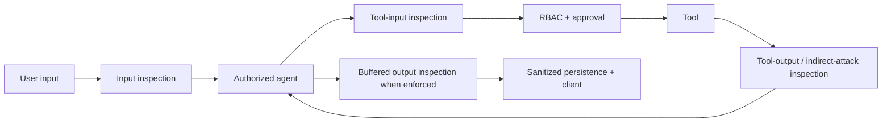

# Agent security and guardrails

This document records the July 2026 investigation behind Plenipo's application-level agent security
pipeline, the controls implemented now, and the remaining work. The central conclusion is simple:
model-native filters are necessary but insufficient for an agent. An agent security policy must
intercept every boundary where untrusted content or authority crosses the orchestration loop.

## What the major platforms do

| Platform/framework | Intervention points | Prompt attacks | Sensitive data | Other notable controls |
|---|---|---|---|---|
| Microsoft Foundry | User input, tool call, tool response, final output | Direct and indirect Prompt Shields | PII (preview for Foundry agents); Azure Language provides dedicated text/conversation/document PII detection and redaction | Harm severity, protected text/code, task adherence; groundedness exists for models but is not yet supported for Foundry agents |
| Microsoft Agent Framework | Agent-run, function-call, and chat-client middleware; the application composes its own checks | Middleware guardrails; experimental FIDES propagates trust labels and enforces policy before sensitive tools (currently documented through the Python security package) | Application/provider responsibility; FIDES also carries confidentiality labels | Explicitly treats every input, history, context, model, and tool boundary as an attack surface; emphasizes least privilege and safe rendering |
| Amazon Bedrock Guardrails | Prompt and response; `ApplyGuardrail` can be used independently around an application | Jailbreak, prompt injection, and prompt leakage | Built-in PII plus custom regex, with block or mask | Denied topics/words, content categories, contextual grounding, automated-reasoning policies |
| Google Model Armor | Prompt and response sanitization; integrated or REST-based policy enforcement point | Prompt injection and jailbreak | Sensitive Data Protection inspection/de-identification, credentials, custom info types | Malicious URL/file detection, harmful-content thresholds, inspect-only/enforce, organization floor settings |
| OpenAI Agents SDK + OpenAI Guardrails | First agent input, final agent output, and before/after each custom function tool | Jailbreak and prompt-injection guardrails; blocking or parallel execution | PII masking/blocking (Presidio-backed in OpenAI Guardrails) | Moderation, URL filtering, hallucination checks, tripwires; built-in/hosted tools do not all pass through custom tool guardrails |
| LangChain/LangGraph | Before/after agent plus wrappers around model/tool calls | Custom deterministic or model-based middleware | Built-in PII middleware: redact, mask, hash, or block across input/output/tool results | Human approval, call limits, custom policy middleware |
| NVIDIA NeMo Guardrails | Input, retrieval, dialog, execution/tool, output | Self-check/model rails and jailbreak heuristics | PII detection/masking on input, retrieval, and output | Fact/hallucination checks, topic control, custom Colang flows, parallel rails |
| Anthropic | Model training/classifiers plus harness, tool permissions, environment isolation, and human control | Classifiers scan untrusted content; Anthropic explicitly says prompt injection remains unsolved | Product/platform privacy controls rather than a general public guardrail API | Emphasizes defense in depth, least privilege, per-action approvals, and constraining the environment/blast radius |

Primary sources:

- [Microsoft Foundry guardrails and controls](https://learn.microsoft.com/en-us/azure/foundry/guardrails/guardrails-overview?view=foundry)
- [Microsoft Foundry hosted-agent guardrails](https://learn.microsoft.com/en-us/azure/foundry/agents/how-to/add-hosted-agent-guardrails)
- [Azure AI Content Safety Prompt Shields](https://learn.microsoft.com/en-us/azure/ai-services/content-safety/quickstart-jailbreak)
- [Azure Language PII detection](https://learn.microsoft.com/en-us/azure/ai-services/language-service/personally-identifiable-information/overview)
- [Microsoft Agent Framework safety guidance](https://learn.microsoft.com/en-us/agent-framework/agents/safety)
- [Microsoft Agent Framework middleware](https://learn.microsoft.com/en-us/agent-framework/agents/middleware/)
- [Microsoft Agent Framework experimental FIDES security](https://learn.microsoft.com/en-us/agent-framework/agents/security)
- [Amazon Bedrock Guardrails components](https://docs.aws.amazon.com/bedrock/latest/userguide/guardrails-components.html)
- [Amazon Bedrock sensitive-information filters](https://docs.aws.amazon.com/bedrock/latest/userguide/guardrails-sensitive-filters.html)
- [Google Model Armor overview](https://docs.cloud.google.com/model-armor/overview)
- [OpenAI Agents SDK guardrails](https://openai.github.io/openai-agents-python/guardrails/)
- [OpenAI Guardrails built-in checks](https://openai.github.io/openai-guardrails-python/)
- [LangChain guardrails](https://docs.langchain.com/oss/python/langchain/guardrails)
- [NVIDIA NeMo Guardrails architecture](https://docs.nvidia.com/nemo/guardrails/about-nemo-guardrails-library/how-it-works)
- [NVIDIA NeMo self-check rails and their limitations](https://docs.nvidia.com/nemo/guardrails/configure-guardrails/guardrail-catalog/self-check)
- [Anthropic prompt-injection defenses](https://www.anthropic.com/research/prompt-injection-defenses)
- [Anthropic trustworthy agents](https://www.anthropic.com/research/trustworthy-agents)
- [OWASP AI Agent Security Cheat Sheet](https://cheatsheetseries.owasp.org/cheatsheets/AI_Agent_Security_Cheat_Sheet.html)
- [OWASP Prompt Injection Prevention Cheat Sheet](https://cheatsheetseries.owasp.org/cheatsheets/LLM_Prompt_Injection_Prevention_Cheat_Sheet.html)

## Cross-framework findings

1. **The correct abstraction is a staged policy, not a stronger system prompt.** The consistent stages are
   user input, retrieved/untrusted context, proposed tool input, tool output, and final model output.
2. **Direct and indirect prompt injection are different problems.** Direct attacks arrive from the user.
   Indirect attacks arrive through email, documents, web pages, RAG chunks, MCP results, and other tools.
   A user-prompt-only filter leaves the more dangerous agent path open.
3. **Authority controls remain deterministic.** A classifier can flag risk, but RBAC, least-privilege tool
   disclosure, parameter validation, iteration limits, and approval of side effects must not depend on model
   judgment. Plenipo already filters tool schemas by permission and approval-gates side effects.
4. **PII needs an action, not merely a label.** Mature systems distinguish inspect-only, redact/mask, and
   block. Redaction must occur before model transmission and before storage/logging.
5. **Output enforcement and token streaming conflict.** If text is released before the complete output is
   classified, the guardrail cannot claw it back. Blocking output therefore requires buffering before release.
6. **Fail-open versus fail-closed must be explicit.** Security-service timeouts are policy decisions. For an
   enforced policy Plenipo defaults to fail closed; audit mode records unavailability and continues.
7. **Inspect-only is the safe rollout path.** Google explicitly recommends starting in inspect-only to measure
   false positives. Microsoft and other systems expose annotate/audit concepts for the same reason.
8. **No classifier solves excessive agency.** Prompt defenses have false positives and false negatives.
   Human approvals, scoped credentials, egress control, tenant isolation, immutable audit, budgets, and loop
   bounds contain the blast radius when a classifier or model fails.

## Open and self-hosted options

Plenipo does not need to make Azure the security boundary. The maintained open ecosystem has useful
components, but they solve different slices of the problem:

| Project/model | Best use | License/operations | Decision for Plenipo |
|---|---|---|---|
| Plenipo prompt guard | Fast first pass for explicit instruction override, role spoofing, authority bypass, prompt extraction, exfiltration, hidden characters, and encoded attacks | In-process .NET; no model, network, or additional license | Built in and always available when prompt-attack detection is enabled |
| [Llama Prompt Guard 2](https://huggingface.co/meta-llama/Llama-Prompt-Guard-2-22M/blob/main/README.md) | Purpose-trained prompt-injection/jailbreak classification; 22M and multilingual 86M variants | Open weights under the Llama Community license rather than a permissive OSI software license; 512-token context requires chunking | Good optional self-hosted classifier once Plenipo has a generic classifier adapter |
| [Presidio](https://github.com/data-privacy-stack/presidio) | Semantic PII detection/anonymization with NLP and custom recognizers | MIT; actively maintained by the Data Privacy Stack; normally a Python service/container | Preferred next provider for broad self-hosted PII |
| [NeMo Guardrails](https://docs.nvidia.com/nemo/guardrails/about-nemo-guardrails-library/overview) | Programmable input/retrieval/tool/output rails and integration with multiple safety models | Apache 2.0 Python framework; substantial parallel orchestration overlap with Plenipo/MAF | Reuse its patterns and models, not a second orchestration runtime |
| [Granite Guardian](https://github.com/ibm-granite/granite-guardian) | Harm, jailbreak, RAG groundedness, and function-call risk through a dedicated local guardian model | Apache 2.0; heavier 5B/8B models; can be served locally through vLLM, Ollama, or compatible runtimes | Strong candidate for an optional local guard-model provider |
| [ShieldGemma](https://ai.google.dev/responsible/docs/safeguards/shieldgemma) | Policy-driven input/output content safety | Open weights; model runtime required | Optional content-safety provider, especially when multimodal inspection is added |
| LLM Guard | Broad scanner catalog | MIT, but the upstream repository is archived and explicitly unmaintained | Do not adopt as a new dependency |

### Why not rely on a security prompt?

A separate self-check prompt is useful as an optional semantic detector, especially when it runs on a
dedicated local guardian model. It is not a deterministic security boundary:

- The evaluator receives the same adversarial language it is being asked to classify and can itself be injected.
- Quality depends on the evaluator model and prompt. NeMo explicitly recommends a purpose-built safety model
  when the LLM does not reliably follow the self-check prompt.
- A self-check adds inference latency and cost at every inspected boundary.
- The model still cannot enforce RBAC, approval, confidentiality flow, or safe tool parameters.

Plenipo therefore owns the staged enforcement pipeline and deterministic controls. Prompt/model classifiers
are replaceable evidence providers inside that pipeline, never the authority that grants a tool permission.

## Plenipo implementation

Plenipo now has a provider-neutral `IAgentSecurityService` policy pipeline. Tenant overrides live with
`TenantAiSettings`. The local prompt and sensitive-data detectors require no external service; the operator
may add Azure AI Content Safety as defense in depth.



Implemented controls:

- `Disabled`, `Audit`, and `Enforce` modes.
- Per-tenant prompt-attack and harmful-content toggles.
- Plenipo prompt-attack detection:
  - Normalizes HTML entities, compatibility Unicode, whitespace, and invisible control characters.
  - Scores explicit instruction override, role impersonation, prompt extraction, authority bypass,
    data-exfiltration, compact/fragmented phrases, and bounded base64-encoded instructions.
  - Runs on user input, proposed tool arguments, and tool responses without a network or model call.
- Optional Azure AI Content Safety augmentation:
  - `text:shieldPrompt` for direct user/tool-call attacks and document-style indirect tool-output attacks.
  - `text:analyze` for hate, self-harm, sexual, and violence categories at configurable severity.
  - Managed identity by default; an API key is an optional deployment secret.
- Deterministic sensitive-data detection for email, US SSN, phone, Luhn-valid payment card numbers,
  common API credentials, and JWTs.
- Sensitive-data `Redact` or `Block` enforcement.
- Pre-model input enforcement. Redacted input is what the model and conversation store receive.
- Pre-tool argument inspection and redaction/blocking.
- Tool-response inspection before the result re-enters model context, covering the main indirect-injection path.
- Full final-answer buffering whenever an enforced output control is active.
- Sanitized conversation persistence. If final output is rewritten, Plenipo discards the framework's opaque
  session state so the unsafe original cannot reappear on the next turn.
- Metadata-only audit findings (`detector`, `category`, `stage`); inspected text and matched values are not logged.
- Audit tool arguments are deterministically redacted even when tenant enforcement is disabled.
- Fail-closed behavior for enforced external controls when screening is unavailable or content exceeds the
  configured inspection limit.

### Operator configuration

```json
{
  "AgentSecurity": {
    "Provider": "None",
    "DefaultMode": "Audit",
    "PromptAttackDetectionEnabledByDefault": true,
    "ContentSafetyEnabledByDefault": false,
    "SensitiveDataHandlingByDefault": "Redact",
    "HarmSeverityThreshold": 4,
    "FailClosed": true,
    "MaxInspectionCharacters": 100000
  }
}
```

This configuration is entirely local. To augment it with Azure Prompt Shields and harmful-content categories,
set `Provider` to `AzureContentSafety` and set `Endpoint` to the resource URL. Use
`AgentSecurity__ApiKey` only from user-secrets, environment configuration, or a secret manager. On Azure,
omit it and grant the workload identity access to the Content Safety resource. The runtime requests the
`https://cognitiveservices.azure.com/.default` scope.

Tenant admins choose nullable overrides in **Admin → AI Settings → Agent security**. Prompt-attack detection
and sensitive-data redact/block work without an external service. Harmful-content categories currently require
the optional Azure connection.

### Semantics

| Mode | Finding behavior | Output streaming |
|---|---|---|
| Disabled | Application controls do not run; model/provider-native filters can still apply | Normal |
| Audit | Record metadata and continue without changing content | Normal |
| Enforce | Block prompt/harm findings; redact or block sensitive data; fail closed on detector outage | Buffered when output controls are active |

## Gaps and next increments

The current release establishes the enforcement architecture, but it is not the end state:

- The local sensitive-data detector is deliberately deterministic and narrow. Add Presidio, Azure Language
  PII, Google Sensitive Data Protection, or another semantic DLP provider for names, addresses,
  medical identifiers, locale-specific identity numbers, and custom tenant entity types.
- Add a generic self-hosted classifier adapter so operators can select Llama Prompt Guard 2 for prompt
  attacks and Granite Guardian or ShieldGemma for safety categories without changing the policy pipeline.
- Scan and label content at ingestion time (files, emails, RAG chunks, and MCP metadata), not only when a tool
  returns it. Runtime tool-output shielding prevents execution but does not remove poisoned stored content.
- Add protected-material text/code detection, groundedness for RAG answers, custom categories/denied topics,
  task-adherence checks, and malicious-URL/file scanning as optional providers.
- Add multimodal inspection. The current application pipeline inspects text only.
- Add policy scope at agent-profile/module level when different domains need different risk tolerances.
- Add a dedicated security-findings query/dashboard rather than reusing the authorization audit stream.
- Add adversarial evaluation datasets and release gates for direct injection, indirect document injection,
  obfuscation, tool argument exfiltration, tool-result poisoning, multi-turn escalation, and false positives.
- Existing historical conversation/session data is not retroactively scrubbed when a tenant enables a policy.
  Plan a one-time sanitation or session invalidation job for deployments with sensitive historical data.

## Recommended rollout

1. Enable Plenipo prompt-attack detection and sensitive-data handling in `Audit`; no external provider is required.
2. Run representative benign traffic and an adversarial corpus; measure findings, latency, false positives,
   classifier outages, and how often output buffering changes perceived latency.
3. Optionally configure Azure augmentation or a future self-hosted classifier; tune harm thresholds and
   explicitly document accepted content for each product/module.
4. Move prompt-attack and sensitive-data controls to `Enforce`; keep high-impact tools RBAC-scoped and
   approval-gated regardless of classifier results.
5. Add semantic PII and ingestion-time scanning before claiming broad regulatory PII/DLP coverage.
6. Re-run adversarial tests after any prompt, model, tool, connector, RAG, memory, or provider change.
