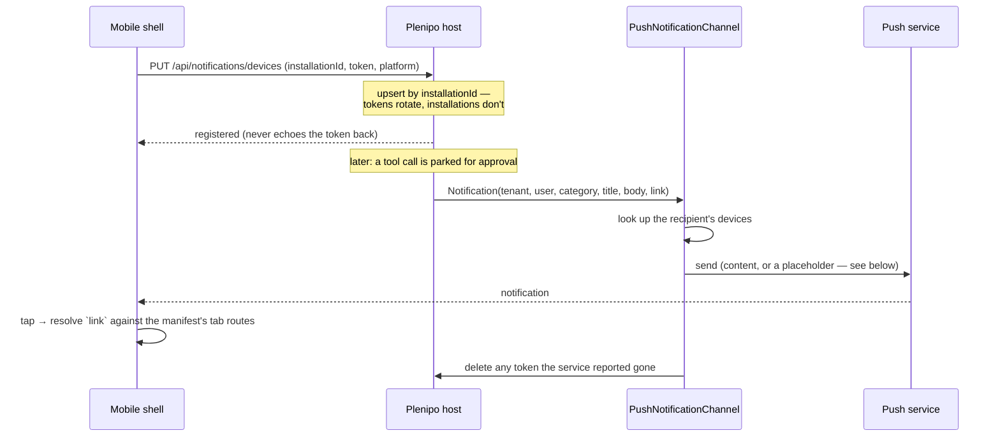

# The mobile shell

Plenipo's mobile app is the same idea as its web app, rendered natively: **one generic shell that
builds itself from the module manifest**, so a product gets a mobile app the way it gets a web UI —
by installing a module in its C# host, not by writing an app.

This document is the map. For the packages themselves see
[`frontend/plenipo-mobile`](../frontend/plenipo-mobile/README.md).

## Why not just a responsive web page

The web shell is already responsive — bottom navigation, card-mode tables. A native app earns its
place on four things a browser can't do well, and three of them are security features this platform
already has:

| | Why it needs to be native |
|---|---|
| **Approvals** | The approval gate is the platform's deliberate bottleneck — a write doesn't happen until a human says so. Its value is bounded by how fast that human can be reached. A push notification plus a one-tap review turns "blocked until someone opens a laptop" into "blocked for ninety seconds". |
| **Push** | iOS web push is weak and easy to lose. A parked write, a finished job, a due deadline — these are the platform's existing `INotificationChannel` fan-out, and a device is where they land. |
| **Capture** | Document intake starts with a camera far more often than a file picker. The platform already has the file store, OCR, and document tools; a phone is the missing front end. |
| **Keystore** | A bearer token belongs in Keychain/Keystore, not in `localStorage`. |

## The three packages

```mermaid
flowchart TD
  Client["@plenipo/client<br/>renderer-free: manifest types, REST, AG-UI, RBAC mirror"]
  Ui["@plenipo/ui<br/>React + DOM"]
  Mobile["@plenipo/mobile<br/>React Native"]
  App["a product's Expo app<br/>(brand + base URL)"]
  Api["Plenipo host<br/>GET /api/platform/modules"]

  Client --> Ui
  Client --> Mobile
  Mobile --> App
  Api -. "the same permission-filtered manifest" .-> Ui
  Api -. .-> Mobile
```

**`@plenipo/client`** is the extraction that makes two renderers safe. It holds the TypeScript
mirror of every C# descriptor (`ModuleManifest`, `TabDescriptor`, `TabEditor`, `TabChart`, …), the
REST surface, the AG-UI transport, the `PermissionMatcher` mirror, the form-default resolver, and
the chart shaping. It imports no React and touches no DOM — enforced by
`src/renderer-free.test.ts`, which reads the sources and fails on `document.`, `window.`,
`localStorage`, `import.meta.env`, or an import of `react`/`react-native`.

Without it, the two shells would each carry their own copy of the contract and drift the first time
`TabDescriptor` grew a field. With it, that field lands in one file and both shells see it.

**`@plenipo/mobile`** is the shell: navigation, the generic renderer, chat, approvals, push
registration, theming, and the product-extension registry.

**`frontend/mobile-app`** is the reference Expo app — about thirty lines, most of them comments. It
is the template a product copies.

## What a product does

Nothing, in the common case. Install a module in the C# host and it appears in the mobile app that
is already on people's phones — module switcher, tabs, tables, editors, charts, detail views,
actions, chat, all rendered from the manifest.

Beyond that there are exactly three tiers, and they mirror the web shell's:

```tsx
// 0. Nothing. A module with no custom mobile code still gets a full UI.

// 1. Brand it.
<PlenipoMobileApp
  config={{ apiBase: "https://api.acme.com", ...expoAdapters() }}
  branding={{ name: "Acme Ops" }}
  theme={{ both: { brand: "#2a78d6" } }}
/>

// 2. Replace one tab's rendering with a native screen. Everything else stays generic.
<PlenipoMobileApp
  config={…}
  moduleUi={[defineModule("legal", { tabs: { matters: MattersBoard } })]}
/>
```

The registry is deliberately the same shape as `@plenipo/ui`'s `defineModule`, so what a team
learned on the web transfers.

## What the shell will not do

These are constraints, not gaps:

- **It cannot widen access.** The manifest arrives permission-filtered; a tab the caller may not
  open is absent, not hidden. Tools are chosen server-side before the model is called. Writes ride
  the approval lane. The client renders what it was handed and has no path to more.
- **It does not interpret the domain.** No screen, route, or vocabulary in the package knows what a
  matter or a transaction is.
- **The manifest describes data and capability, never layout.** `TabDescriptor` says *there are
  these columns, this editor, this chart* — not *put it in a table*. That is why one descriptor can
  become a web table and a native card list. Resist adding presentational fields to it; if a tab
  needs a specific look, that is what `defineModule` is for.

## Platform adapters

The core imports no native module. Secure storage, auth, device identity, push, locale, and the
streaming fetch all arrive as injected adapters (`src/adapters.ts`). `@plenipo/mobile/expo`
implements all of them on the standard Expo modules, so the ordinary path is one line:

```tsx
config={{ apiBase: "…", ...expoAdapters() }}
```

The indirection buys three things: the core is testable in plain Node with no device, a product can
swap any single adapter (a corporate MDM push gateway, an existing keychain wrapper) without
forking, and an app that wants no notifications simply omits the push adapter and is never asked
for the permission.

One adapter matters more than the rest: **`fetch`**. React Native's built-in fetch buffers the
whole response, which would turn a streaming chat answer into a long silence followed by a wall of
text. The Expo adapters supply `expo/fetch`, which streams.

## Chat rides AG-UI, not SignalR

The web shell talks to `/hubs/agent` over SignalR. The mobile shell posts to
`/api/agui/{moduleId}` and reads SSE.

This is a radio decision, not a security one. A WebSocket on a phone dies on every backgrounding,
network hand-off, and lock — it would spend its life reconnecting. Plain HTTP + SSE survives that.
Both transports drive the same `AuthorizedAgentRunner`, so RBAC tool-filtering, the approval gate,
auditing, and token accounting are byte-for-byte identical either way. AG-UI is also an open
protocol, so the same endpoint serves any AG-UI client.

## Push, end to end

Push is the platform's existing notification-channel seam (`INotificationChannel`), implemented
once and generically — not a mobile special case.



Pieces worth knowing:

- **`IPushTransport`** is the swap point. The built-in `ExpoPushTransport` fronts both APNs and FCM
  with one HTTP call and no Apple or Google credentials in the repo or in CI — the platform's
  keyless-by-default rule applied to notifications. One DI registration replaces it.
- **The channel is inert until a device registers**, so a deployment with no mobile app pays
  nothing and configures nothing.
- **`Push:IncludeContent`** is a real privacy control, not formatting. A push provider is a third
  party and a lock screen is readable by anyone holding the phone. A deployment handling privileged
  material sets it to `false`: the device gets "You have a new notification", and the app fetches
  the actual content over its authenticated session after the tap.
- **A device identifier goes one way.** No endpoint ever returns a push token, including the
  caller's own device list.
- **Dead tokens are deleted**, not flagged — an unreachable token is worth nothing and is still a
  device identifier.

## Deep links

`Notification.Link` is app-relative (`/legal/matters/42`) and already exists — the in-app inbox uses
it. The shell resolves it by longest-prefix match against the tabs' declared `route`s and navigates
there.

Deliberately, it lands on the **list** the record belongs to rather than guessing at a detail
screen: a link points at a record, while a manifest only ever promised the route of the tab that
contains it. Landing somewhere correct beats guessing somewhere specific.

## Authentication

The shell asks its `AuthAdapter` for a bearer token before every request, so a token refreshed
mid-session is picked up without a restart. Returning `null` is a supported answer, not a failure:
the shell then sends the platform's dev-auth headers, which is what lets a freshly generated app
talk to a local host with no IdP, no client id, and nothing configured. A production app returns a
real token (expo-auth-session, MSAL, whatever the product uses); tokens are kept in the OS keystore
via `expo-secure-store`, never in plain storage.

## Running it

```bash
pnpm -C frontend install
pnpm -C frontend/mobile-app start
```

Then scan the QR code with Expo Go. Point `EXPO_PUBLIC_API_BASE` at your host — a device cannot
reach `localhost`, so use the LAN address Expo prints. With the platform's Mock AI provider the
chat works with no API key at all.

```bash
# The tests: the manifest→UI mapping, against a faked API. No device, no backend.
pnpm -C frontend/plenipo-mobile test
```

## Known limits

- **Offline is read-through only.** TanStack Query caches in memory and refetches on reconnect;
  there is no persisted cache and no write queue. A queued write would have to be reconciled
  against the approval gate, which is a design question, not a coding one.
- **No E2E on a device in CI.** The renderer is covered by component tests against a faked API;
  nothing here has been driven on a real simulator in this repo yet.
- **Attachments are not wired into the mobile composer.** The platform's file store, the upload
  endpoint, and the cross-platform `uploadFile` (which accepts a React Native `{ uri, name, type }`
  descriptor) are all ready; the camera/picker UI in the chat composer is not built.
- **The admin console has no mobile surface**, matching the web split — operator administration
  stays on the desktop console.
