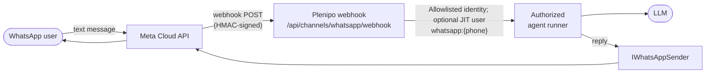

# WhatsApp channel

Plenipo can answer WhatsApp messages: an inbound text becomes an **authorized agent turn** — the same
security spine as the web chat (per-user tool filtering before the model call, auditing, token
tracking, and the human-in-the-loop approval gate) — and the agent's reply is sent back over the
Meta WhatsApp Business **Cloud API**.



## How identity works

Each phone number is **just-in-time provisioned** as a platform user in the configured tenant, with
subject `whatsapp:{phone}` and the `user` role — so WhatsApp users appear in the admin console, can
be deactivated, granted or revoked permissions, and audited exactly like web users. The agent runs
with *that user's* authority: the model never sees a tool the phone's owner may not call, and
side-effecting tools are still held for approval (the reply tells the sender an operator must
approve; approvals happen in the workspace/admin UI).

Every message from one phone number continues a single, tenant-scoped conversation (the id is a
stable hash of tenant + phone), so context persists across messages like any chat thread.

## Configuration

Bound from `Channels:WhatsApp` (disabled by default; validated at startup — an enabled channel with
missing settings fails fast):

| Setting | Meaning |
|---------|---------|
| `Enabled` | Master switch (default `false`; when off the webhook endpoints return 404) |
| `VerifyToken` | The token you choose and paste into Meta's webhook setup (verification handshake) |
| `AppSecret` | **Secret.** Meta app secret; verifies the `X-Hub-Signature-256` HMAC on every delivery |
| `AccessToken` | **Secret.** Cloud API bearer token (a system-user token in production) |
| `PhoneNumberId` | The WhatsApp Business phone-number id that sends replies |
| `ModuleId` | The module whose agent answers (e.g. `finance`) |
| `TenantSlug` | The tenant WhatsApp users are provisioned into (e.g. `dev`) |
| `ApiBaseUrl` | Cloud API base (default `https://graph.facebook.com/v21.0`); tests point it at a fake |
| `MaxMessageLength` | Per-message split size for long replies (default 4096, WhatsApp's cap) |

Local example (secrets via user-secrets, never committed):

```bash
dotnet user-secrets --project samples/Plenipo.Sample.Host set "Channels:WhatsApp:Enabled" "true"
dotnet user-secrets --project samples/Plenipo.Sample.Host set "Channels:WhatsApp:VerifyToken" "<your-choice>"
dotnet user-secrets --project samples/Plenipo.Sample.Host set "Channels:WhatsApp:AppSecret" "<meta-app-secret>"
dotnet user-secrets --project samples/Plenipo.Sample.Host set "Channels:WhatsApp:AccessToken" "<cloud-api-token>"
dotnet user-secrets --project samples/Plenipo.Sample.Host set "Channels:WhatsApp:PhoneNumberId" "<phone-number-id>"
```

In production the two secrets live in Key Vault and reach the container as
`Channels__WhatsApp__AppSecret` / `Channels__WhatsApp__AccessToken` (see `infra/`).

## Meta setup (once per deployment)

1. In [Meta for Developers](https://developers.facebook.com/), create an app with the **WhatsApp**
   product; note the **app secret**, a **phone number id**, and a long-lived **access token**.
2. Under WhatsApp → Configuration, set the webhook callback URL to
   `https://<your-host>/api/channels/whatsapp/webhook` and the verify token to your `VerifyToken`
   value, then subscribe to the **messages** field. Meta performs a GET handshake; Plenipo echoes the
   challenge automatically.
3. Send a WhatsApp message to the business number — the module's agent answers.

## Security notes

- The webhook is anonymous by necessity; **every** POST is verified against the app-secret HMAC
  (`X-Hub-Signature-256`, constant-time comparison) before any parsing or processing.
- Meta redelivers on slow/failed responses; deliveries are deduplicated by message id (in-memory,
  per instance).
- **Documents and images are first-class**: inbound media is downloaded via the Cloud API's two-step
  media endpoint (`IWhatsAppMediaClient`), stored in the tenant file store with `whatsapp`
  provenance, and the agent turn carries the same plain-text attachment reference the web composer
  uses — so `read_document` / `ocr_document` work identically over WhatsApp (the caption becomes the
  user message; see [DOCUMENT_TOOLS.md](DOCUMENT_TOOLS.md)). Audio/location/etc. get a polite notice;
  delivery-status callbacks are acknowledged and ignored.

## Testing without Meta

The E2E suite (`samples/Plenipo.Sample.Host.IntegrationTests/WhatsAppChannelTests.cs`) exercises the
channel with **no Meta account, credentials, or network**: the Mock AI provider answers the agent
turn and a capturing fake replaces `IWhatsAppSender` (the Cloud API base URL is also configurable if
you prefer a stand-in HTTP server). The tests drive the webhook exactly as Meta does — anonymous
POSTs with a real HMAC signature — so signature verification, provisioning, the authorized runner,
conversation persistence, dedupe, and outbound replies are all covered:

```bash
dotnet test samples/Plenipo.Sample.Host.IntegrationTests --filter FullyQualifiedName~WhatsApp
```
